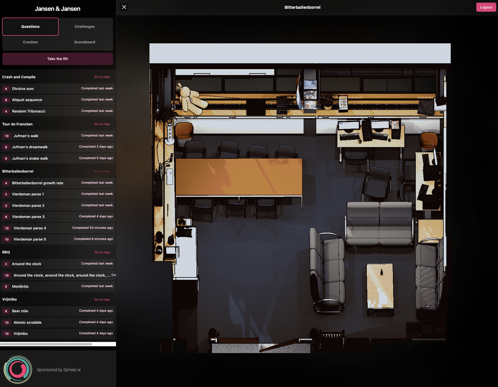

## Crash and Compile : 2024 Lustrum Edition
#### Team Jansen & Jansen. Original event on October 11th, 2024 17.00 at [spheer.ai](https://www.spheer.ai).

### 01 - Divisive sum

Find the sum of the number of divisors of each integer from 1 up to and including 241012. For instance: 5 has 2 divisors: 1, 5; 6 has 4 divisors: 1, 2, 3, 6; 12 has 6 divisors: 1, 2, 3, 4, 6, 12.

### 02 - Aliquot sequence

You can create a sequence of numbers if you know how to generate divisors of a number. Step one: obtain all divisors of a number, excluding the number itself. Step two: sum all these divisors. Step three: repeat the process but with the newly obtained sum. For instance, start at number 12. 12 has divisors 1, 2, 3, 4, and 6 (excluding 12 itself). The sum is 1 + 2 + 3 + 4 + 6 = 16. 16 has divisors 1, 2, 4, 8, which sums to 13. 13 is a prime, so the only relevant divisor here is 1. The sequence ends here. As you can see the sequence doesn't necessarily go down each step, and sometimes it will reach really large numbers. We want you to investigate the behavior of this sequence. Generate this sequence for the numbers up to and including 1210. You can stop whenever a number in the sequence exceeds 20241012. Find the sum of the first value in every sequence that exceeds 20241012

### 03 - Random Tribonacci

The Fibonacci sequence is fairly well-known. You start with numbers: F(0) = 1, and F(1) = 1. F(2) is then given by adding up numbers F(1) and F(0), or 1 + 1 = 2. F(3) is then given by 2 + 1 = 3. Or more general: F(n) = F(n - 1) + F(n  - 2). For the Tribonacci sequence you start with numbers: T(0) = 1, T(1) = 1, and T(2) = 1, and obtain the next number by adding all previous 3 numbers. The random Tribonacci sequence is obtained by randomly changing whether you add the previous numbers or subtract them. This means that in half of the cases, T(n) = T(n - 1) + T(n - 2) + T(n - 3), and in the other half of the cases, T(n) = T(n - 1) - T(n - 2) - T(n - 3). It is possible to define a growth factor for this sequence, which happens to converge to a limit. The growth factor is defined by the n-th root of the absolute value of the n-th Tribonacci number, or abs(T(n))^(1/n). Find the growth factor up to 3 decimals of precision.

### 04 - Jufman's walk

After the Tour de Francken, you start walking home. You've been playing juf since the Tour ended, and can't get it out of your head. As a result, you start counting every step, and turn left whenever you count a jufnumber. What number do you count when you reach a distance of 40 steps from your starting position? Jufnumbers are numbers that are divisible by 7, contain 7 or are palindromes. The distance of 40 steps is measured using the taxicab metric (1-norm). You always take a step when counting, so when you turn left you also take a step.

### 05 - Jufman's dreamwalk

You've finally managed to get home, and fell into a drunken stupor, seconds after you hit the bed. In your dreams you continue 'walking'. No longer limited by the rules of reality, your dreamwalk takes to the sky. As a result, you keep counting every step, however this time you only turn left when a number has only one reason to be juf, and you turn up when a number has more than 1 reason to be juf. What number do you count when you reach a distance of 40 steps from your starting position? Jufnumbers are numbers that are divisible by 7, contain 7 or are palindromes. The distance of 40 steps is measured using the taxicab metric (1-norm). You always take a step when counting, so when you turn left or up you also take a step. Turning left is what you expect it to be, a rotation of 90 degrees around the axis running from your feet to your head (and then taking a step). Turning up is pretty much laying down on your back, which corresponds to a rotation around some vaguely defined axis that runs through the left and right side of your body, (and flying up 1 step into the sky).

### 06 - Jufman's snake walk

After the Tour de Francken, you start walking home. After the Tour ended, you've been playing juf the entire time, and can't get it out of your head. As a result, you start counting every step, and turn left whenever you count a jufnumber, that is juf for 1 reason. You turn right whenever a number is juf for 2 reasons, and you turn back when a number has 3 reasons to be juf. Reasons to be juf are: the number is divisible by 7, the number is a palindrome and/or the number contains one or more 7s. Walking this way you folow a pattern not unlike in the game snake. Luckily you don't die when you bite your own tail (when you visit a position you've visited before). Find the number you count, when you revisit any position you've been before for the 1210th time.

### 07 - Bitterballenborrel growth rate

During an earlier crash and compile we hosted a Bitterballenborrel idle game. Idle games, or clicker games, are know for their non-linear growth rates and huge numbers. We replicated this by generating a table of growth rates using the Pascal Triangle. For each additional point a team would get we would grab a corresponding row from the triangle and would add up all the numbers in that row, using a weight for each consecutive number. The weight was simply generated by dividing each respective number by an additional factor of 10. Take for instance the seventh row, which consists of numbers 1 7 21 35 35 21 7 1, would be mapped to 1 + 7/10 + 21/100 + 35/1000 + 35/10000 + 21/100000 + 7/1000000 + 1/10000000 which is about 1.95. What is the growth factor obtained this way corresponding to 1984 points? Note that players with 0 points have a growth rate of 1, which corresponds to the top row. The answer has to be accurate up to 10 digits of significance.

### 08 - Vierdeman parse 1

You've obtained a notebook full of klaverjas rounds from [data/klaverjas-handjes.txt](data/klaverjas-handjes.txt). The notebook contains all bids (and passes), and all cards played. Find the total amount of passes.
### 09 - Vierdeman parse 2

Now that you know how to read the notebook. Find the amount of times that a sans bid won. That is, how many times did the players play a round without any suit that was trump.

### 10 - Vierdeman parse 3

Figure out how often the last trick (slag) of a round contained a trump card.

### 11 - Vierdeman parse 4

On [data/tournament_simplified.json](data/tournament_simplified.json) you can find a more elaborate data dump of the klaverjas notebook you found earlier. Using the extra information at your disposal, find the amount of times a round was won with a cowardly bid (laf bod). A corwardly bid occurs when you could've bid higher. For instance you bid 142, but you get 155 points (and the opponent gets 7). That means you could've bid 152.

### 12 - Vierdeman parse 5

On [data/tournament_simplified.json](data/tournament_simplified.json) you can find a more elaborate data dump of the klaverjas notebook you found earlier. Using the extra information at your disposal, find the amount of times that a team went wet because of the fame.

### 13 - Around the clock

Looking at the arrows of the drawing that replaces the clock, you remember a brain teaser you never understood as a child in elementary school. An analog clock has 2 hands, that update their position every second. During a full day, how many times do both hands pass each other? For the purpose of this question, a day starts at 0:00 and ends at 23:59:59

### 14 - Around the clock, around the clock, around the clock, ...

The analog clock in the Francken room has 2 hands. Whenever the the minute hand of the clock passes the hour hand, someone from Idun brings you a new clock that somehow is twice as slow as the clock which hands just passed. How many times do all the minute hands of all the clocks lap their hour hands, during a full day? For the purpose of the question a day starts at 0:00:00, and ends at 23:59:59. The clocks you get from Idun all start at 0:00:00. Note: during a race you lap someone when you not only overtake them, but you also did at least a full round extra.

### 15 - Mexlijntje

During a Francken BBQ you always used to play 1 of 2 games. The first one was juffen, and the other one was Mexen. Your favourite part of Mexen, always was the mexlijntjes. You would always continnue a mexlijntje, even if that might be foolish when you calculate the probability of mex in a mexlijntje. Is it foolish though? What is the probability that you get mex during a mexlijntje? The answer should be given as the 3 digits the odds (If P=0.5019 then submit 501). Some clarification: During a mexlijntje, one may throw at most three times where each 1 or 2 may be kept at most once. Mex is a 1 and a 2. Throwing a 3 and a 1 the player has to rethrow without keeping the 1, but without losing a try. This assignment may of course also be solved by hand.

### 16 - Beer mile

The borrelcie has tried to organize a beer mile event for many years, but failed to do so. We suspect they just want to drink their beers, and don't want to run a mile for it. A beer kilometer was suggested, but that was shot down, because it just didn't have the same ring to it. Did you know you can use the Fibonacci sequence to approximately convert miles into kilometers. For instance take the forth and fifth elements in the sequence, 3 and 5. 3 miles is about 5 kilometers. 5 miles is about 8 kilometers, and so on. This is just an approximation, so each fibonacci conversion will have an error compared to the true value. What is the error the first time it is more than half a mile? According to wikipedia a mile is 1.609344 kilometers. The Fibonacci sequence is defined by the starting values 1 and 1, and each consecutive number is the sum of the previous two number. Example: 1 1 2 3 5 8 13 ...

### 17 - Atomic scrabble

You stare at the projector screen and your mind wanders the the time you attempted to solve the AIVD chrismass puzzle. You remeber seeing those insanely difficult to decipher questions on the screen. One time you had to do something with the scrabble score of letters, and figure out how that affected some sort of encoding. You think. You can't really remember what it was. Suddenly you hear a familiar voice whispering: You're thinking about scrabble now, aren't you? I have a question for you: 'What is the longest word in the english language scrabble dictionary that does not have the property that shorter words could be made from its letters?' Note: The dictionary can be found here: [data/dictionary.json](data/dictionary.json). Second note: If you find multiple possible answers, choose the one with the highest scrabble score.

### 18 - Vrijmibo

Since nobody is around you use your leet-haxxor skills to take a peek into the streep database. Use this opportunity to figure out how many beers have been drunk during vrijmiboes, both official ones and unofficial ones. Note that vrijmiboes necessarily start on Fridays, but don't necessarily have to end on Fridays, so for the purpose of this question start the borrel at 12:00 and end it at 9:00 the following day. You can find the database here: [data/francken-transactions.sqlite](data/francken-transactions.sqlite).
